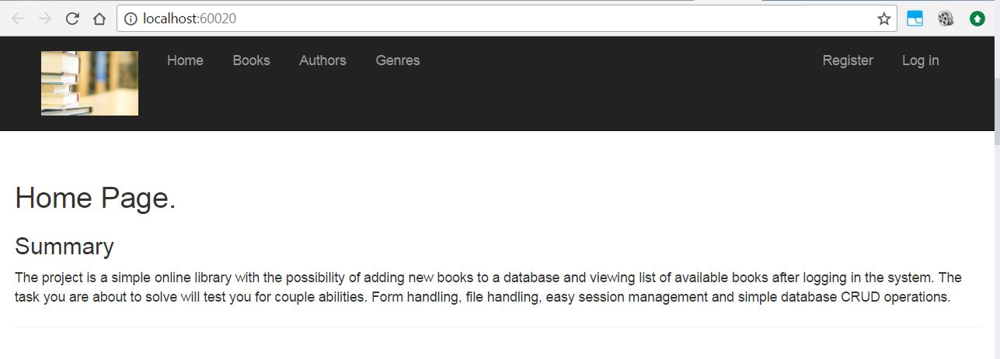

# Book Library

 

## Simple online bool library project.

Simple online library with the possibility of adding new books to a
database and viewing list of available books after logging in the system.

----------
## Used Technologies
- ASP.NET MVC;
- MSSQL;
- Entityframework;
- Bootstrap;
- ...

## Screenshots

### The home page

 

### The books page

 

### The authors page

 

### The genres page

 

## Installation
- Clone the repository localy;
- User the genreate databse script for creating database in your local MSSQL installation. 
[GitHub](http://github.com)
	- Use Shema and Data 
	[Generate database script-Shema and Data.sql](./Database/Generate%20database%20script-Shema%20and%20Data.sql) 
	- Change folowing lines according your local installation path.
		> ( NAME = N'BookLibrary', FILENAME = N'C:\Program Files\Microsoft SQL Server\MSSQL12.MSSQLSERVER\MSSQL\DATA\BookLibrary.mdf' , SIZE = 5120KB , MAXSIZE = UNLIMITED, FILEGROWTH = 1024KB )
		> ( NAME = N'BookLibrary_log', FILENAME = N'C:\Program Files\Microsoft SQL Server\MSSQL12.MSSQLSERVER\MSSQL\DATA\BookLibrary_log.ldf' , SIZE = 1024KB , MAXSIZE = 2048GB , FILEGROWTH = 10%)
	
- Change the ConnectionString in the Web.config if using MSSQL Express version 
[ConnectionStrings location](./Source/BookLibrary.Clients.Web/Configurations/ConnectionStrings.config)
- Try!

